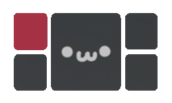
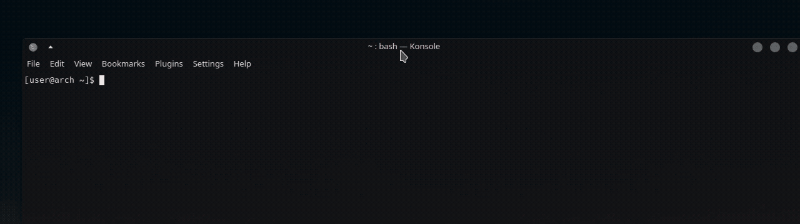
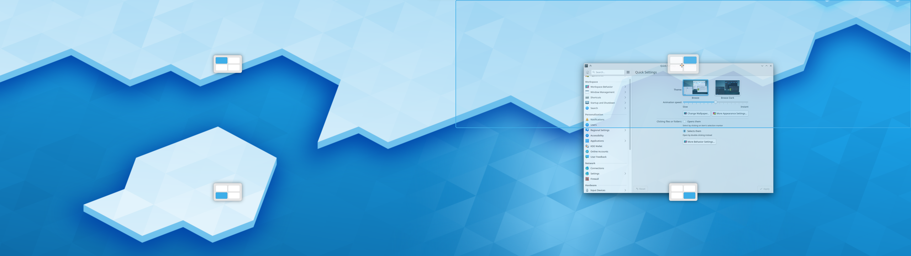

# KZones



KDE KWin Script for snapping windows into zones. Handy when using a (super) ultrawide monitor, an alternative to PowerToys FancyZones and Windows 11 snap layouts.

## Features

### Zone Selector

The zone selector is a small widget that appears when you drag a window to the top of the screen. It allows you to snap the window to a zone regardless of the current layout.



### Zone Overlay

The zone overlay is a fullscreen overlay that appears when you move a window. It shows all zones from the current layout and the window will snap to the zone you drop it on.


### Multiple Layouts

Create multiple layouts and cycle between them.


### Theming

KZones uses the same colors as your selected color scheme, so it will always fit in with your desktop.



### Shortcuts

Snap windows using shortcuts (full list below)


## Installation

Install via KDE Store or clone this repo and run the `./build` script.

### KDE Store

Under System Settings / KWin Scripts / Get New Scripts, search for KZones and install it.  
https://store.kde.org/p/1909220

### Build it yourself
Make sure you have "zip" installed on your system before building.
```
git clone https://github.com/gerritdevriese/kzones
cd kzones && ./build
```

## Setup

### General

#### Show zones when I start moving a window

While moving a window you will have the option to snap it to a zone. Either by dragging it to it's indicator or the full zone.

#### Show zone selector when I drag a window to the top of the screen

When enabled, a zone selector will appear when you drag a window to the top of the screen. Which allows you to snap the window to a zone. The selector displays all zones from all layouts.

#### Remember and restore window geometries

When enabled, the script will remember the geometry of each window when it's moved to a zone. When the window is moved out of the zone, it will be restored to it's original geometry.

#### Require shortcut to show overlay

When enabled, the overlay will only be shown when the "Toggle OSD" shortcut is pressed. Otherwise the overlay will be shown when moving a window. Previously known as "Inverted mode".

### Layouts

You can define your own layouts by modifying the JSON in the **Layouts** tab in the script settings, here are some examples to get you started:

#### Examples
<details open>
  <summary>Single layout</summary>

```json
[
    {
        "name": "Layout 1",
        "padding": 10,
        "zones": [
            {
                "name": "1",
                "x": 0,
                "y": 0,
                "height": 100,
                "width": 25
            },
            {
                "name": "2",
                "x": 25,
                "y": 0,
                "height": 100,
                "width": 50
            },
            {
                "name": "3",
                "x": 75,
                "y": 0,
                "height": 100,
                "width": 25
            }
        ]
    }
]
```

</details>

<details>
  <summary>Multiple layouts</summary>

```json
[
    {
        "name": "Layout 1",
        "padding": 0,
        "zones": [
            {
                "name": "1",
                "x": 0,
                "y": 0,
                "height": 100,
                "width": 25
            },
            {
                "name": "2",
                "x": 25,
                "y": 0,
                "height": 100,
                "width": 50
            },
            {
                "name": "3",
                "x": 75,
                "y": 0,
                "height": 100,
                "width": 25
            }
        ]
    },
    {
        "name": "Layout 2",
        "padding": 0,
        "zones": [
            {
                "name": "1",
                "x": 0,
                "y": 0,
                "height": 50,
                "width": 25
            },
            {
                "name": "2",
                "x": 0,
                "y": 50,
                "height": 50,
                "width": 25
            },
            {
                "name": "3",
                "x": 25,
                "y": 0,
                "height": 100,
                "width": 50
            },
            {
                "name": "4",
                "x": 75,
                "y": 0,
                "height": 50,
                "width": 25
            },
            {
                "name": "5",
                "x": 75,
                "y": 50,
                "height": 50,
                "width": 25
            }
        ]
    }
]
```

</details>

#### Explanation

The main array can contain as many layouts as you want:
   
Each **layout** object needs the following keys:
- `name`: The name of the layout, shown when cycling between layouts
- `padding`: The amount of space between the window and the zone in pixels
- `zones`: An array containing all zone objects for this layout

Each **zone** object needs the following keys:
- `x`, `y`: position of the top left corner of the zone in screen percentage
- `width`, `height`: size of the zone in screen percentage

### Other settings

#### Filtering

You can block certain windows from snapping by adding their class name to the exclude list. Or you can only allow certain windows to snap by adding their class name to the include list. You can find the class name of a window by running `xprop` in a terminal and clicking on the window. The class name will be in the `WM_CLASS` property.

#### Polling rate

The polling rate is the amount of time between each zone check when dragging a window. The default is 100ms, a faster polling rate is more accurate but will use more CPU. You can change this to your liking.

#### Debug mode

When debug mode is enabled, the script will log more information and show extra information in the overlay.

## Shortcuts

List of all available shortcuts:

| Shortcut                                  | Default Binding  |
| ----------------------------------------- | ---------------- |
| Move active window to zone                | `Ctrl+Alt+[0-9]` |
| Move active window to previous zone       | `Ctrl+Alt+Left`  |
| Move active window to next zone           | `Ctrl+Alt+Right` |
| Switch to previous window in current zone | `Ctrl+Alt+Down`  |
| Switch to next window in current zone     | `Ctrl+Alt+Up`    |
| Cycle between layouts                     | `Ctrl+Alt+D`     |
| Toggle OSD                                | `Ctrl+Alt+C`     |

*To change the default bindings, go to System Settings / Shortcuts and search for KZones*

## Troubleshooting

### The script doesn't work

- Check if your KDE version is at 5.27 or higher.
- Make sure there is at least one layout defined in the script settings and that it contains at least one zone.

### My settings are not saved

- After changing settings, you need to reload the script by disabling, saving and enabling it again. (or by restarting KWin)