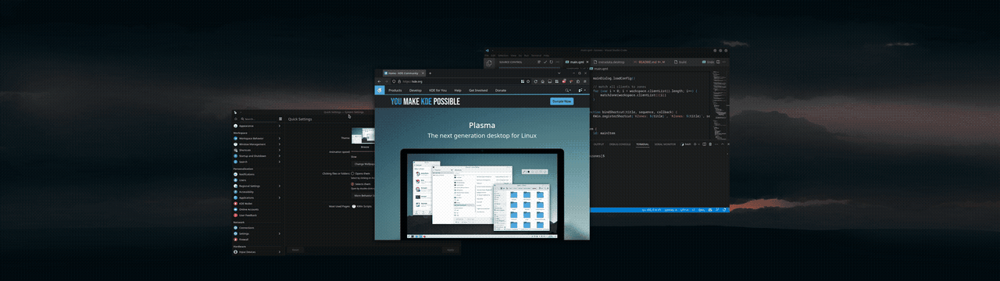

# KZones
KDE KWin Script for snapping windows into zones. Handy when using a (super) ultrawide monitor.  
An alternative to PowerToys FancyZones.

## Features
### Drag & Drop
Dragging windows to a zone

### Multiple Layouts
Create multiple layouts and cycle between them

### Shortcuts
Snap windows using shortcuts (full list below)


## Installation
Install via KDE Store or clone this repo and run the `./build` script.
### KDE Store
Under System Settings / KWin Scripts / Get New Scripts, search for KZones and install it.  
https://store.kde.org/p/1909220
### Build it yourself
Make sure you have "zip" installed on your system before building.
```
git clone https://github.com/gerritdevriese/kzones
cd kzones && ./build
```

## Setup
### Layouts
You can define layouts by putting them in the **Layouts** tab in the script settings, here are some examples to get you started:
#### Examples
<details open>
  <summary>Single layout</summary>

```json
[
    {
        "name": "Layout 1",
        "padding": 10,
        "zones": [
            {
                "name": "1",
                "x": 0,
                "y": 0,
                "height": 100,
                "width": 25
            },
            {
                "name": "2",
                "x": 25,
                "y": 0,
                "height": 100,
                "width": 50
            },
            {
                "name": "3",
                "x": 75,
                "y": 0,
                "height": 100,
                "width": 25
            }
        ]
    }
]
```

</details>

<details>
  <summary>Multiple layouts</summary>

```json
[
    {
        "name": "Layout 1",
        "padding": 0,
        "zones": [
            {
                "name": "1",
                "x": 0,
                "y": 0,
                "height": 100,
                "width": 25
            },
            {
                "name": "2",
                "x": 25,
                "y": 0,
                "height": 100,
                "width": 50
            },
            {
                "name": "3",
                "x": 75,
                "y": 0,
                "height": 100,
                "width": 25
            }
        ]
    },
    {
        "name": "Layout 2",
        "padding": 0,
        "zones": [
            {
                "name": "1",
                "x": 0,
                "y": 0,
                "height": 50,
                "width": 25
            },
            {
                "name": "2",
                "x": 0,
                "y": 50,
                "height": 50,
                "width": 25
            },
            {
                "name": "3",
                "x": 25,
                "y": 0,
                "height": 100,
                "width": 50
            },
            {
                "name": "4",
                "x": 75,
                "y": 0,
                "height": 50,
                "width": 25
            },
            {
                "name": "5",
                "x": 75,
                "y": 50,
                "height": 50,
                "width": 25
            }
        ]
    }
]
```

</details>

#### Explanation
The main array can contain as many layouts as you want:
   
Each **layout** object needs the following keys:
- `name`: The name of the layout, shown in the OSD when cycling between layouts
- `padding`: The amount of space between the window and the zone in pixels
- `zones`: An array containing all zone objects for this layout

Each **zone** object needs the following keys:
- `name`: The name of the zone, shown inside the zone indicator (can be left blank)
- `x`, `y`: position of the top left corner of the zone in screen percentage
- `width`, `height`: size of the zone in screen percentage

#### Indicator offset

If for some reason you want to move the zone indicator, you can do so by adding the following keys to a zone object:

```json
{
    "name": "2",
    "x": 25,
    "y": 0,
    "height": 100,
    "width": 50,
    "indicator": {
        "offset": {
            "x": 100,
            "y": -50
        }
    }
}
```

This example will move the indicator 100 pixels to the right and 50 pixels up.

### Other settings

#### Determine zone

###### Target
The Target can be set to **Indicator** or **Zone**. **Indicator** is the default and will snap the window to the zone if the chosen method is inside the zone indicator. Choose **Zone** if you want to always snap the window to the zone it's dropped in. (you can cancel the snap with the "Toggle OSD" shortcut)

###### Method
By default the script will use the **Titlebar** method to determine which zone a window should snap to. This means that the window will snap when the target contains the titlebar of the window. You can change this behaviour by setting the method to **Cursor** or **Window**.

###### Size
Change the size of the chosen method, for example when using the **Titlebar** method you can decrease the size of the "handle" to make it easier to snap windows to the correct zone. You can temporarily enable debug mode to see the exact size of the "handle".

#### Filtering
You can block certain windows from snapping by adding their class name to the exclude list. Or you can only allow certain windows to snap by adding their class name to the include list. You can find the class name of a window by running `xprop` in a terminal and clicking on the window. The class name will be in the `WM_CLASS` property.

#### Polling rate
The polling rate is the amount of time between each zone check when dragging a window. The default is 100ms, a faster polling rate is more accurate but will use more CPU. You can change this to your liking.

#### Inverted mode
When enabled, moving windows will not trigger the osd. Instead you'll have to use the "Toggle OSD" shortcut to show the osd.

## Shortcuts
List of all available shortcuts:
| Shortcut                                      | Default Binding           |
|-----------------------------------------------|---------------------------|
| Move active window to zone                    | `Ctrl+Alt+[0-9]`          |
| Move active window to previous zone           | `Ctrl+Alt+Left`           |
| Move active window to next zone               | `Ctrl+Alt+Right`          |
| Switch to previous window in current zone     | `Ctrl+Alt+Down`           |
| Switch to next window in current zone         | `Ctrl+Alt+Up`             |
| Cycle between layouts                         | `Ctrl+Alt+D`              |
| Toggle OSD                                    | `Ctrl+Alt+C`              |

*To change the default bindings, go to System Settings / Shortcuts and search for KZones*

## Troubleshooting

### The script doesn't work
- Check if your KDE version is up to date.
- Make sure there is at least one layout defined in the script settings and that it contains at least one zone.

### My settings are not saved
- After changing settings, you need to reload the script by disabling, saving and enabling it again. (or by restarting KWin)