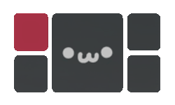
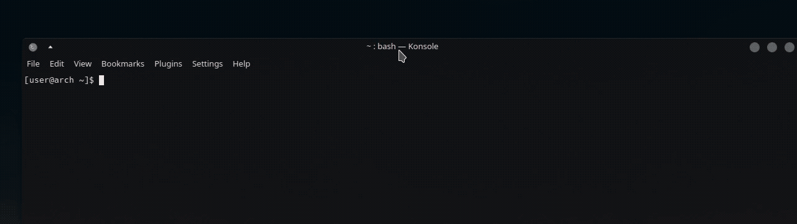
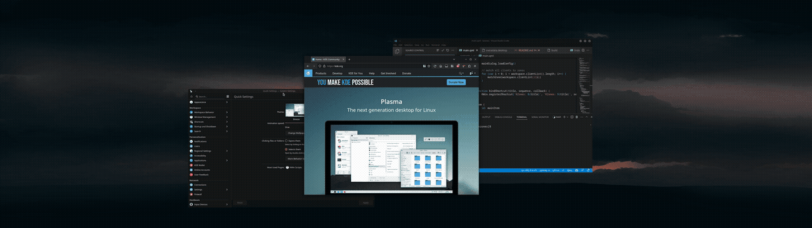
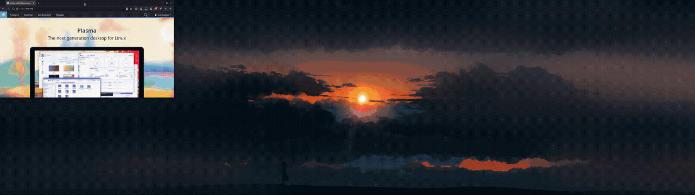
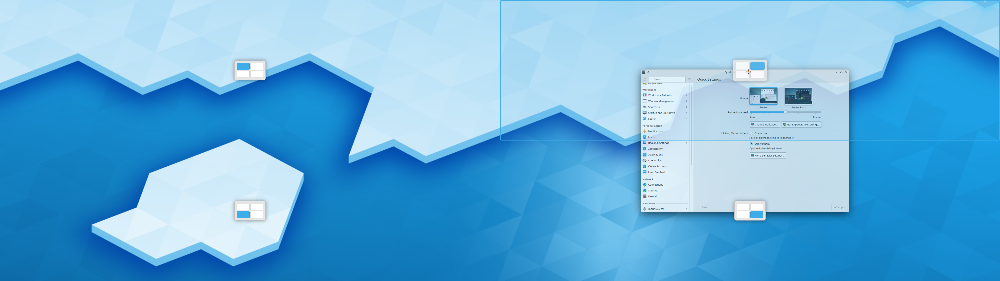

# KZones



KDE KWin Script for snapping windows into zones. Handy when using a (super) ultrawide monitor, an alternative to PowerToys FancyZones and Windows 11 snap layouts.

[](https://store.kde.org/p/1909220)
[](https://aur.archlinux.org/packages/kwin-scripts-kzones)
[](https://mynixos.com/nixpkgs/package/kdePackages.kzones)

## Features

### Zone Selector

The Zone Selector is a small widget that appears when you drag a window to the top of the screen. It allows you to snap the window to a zone regardless of the current layout.



### Zone Overlay

The Zone Overlay is a fullscreen overlay that appears when you move a window. It shows all zones from the current layout and the window will snap to the zone you drop it on.



### Edge Snapping

Edge Snapping allows you to snap windows to zones by dragging them to the edge of the screen.


### Multi-monitor support

Create layouts tailored for specific device, screen resolution or display orientation so you
can have each of your display configurable separately. 

### Multiple Layouts

Create multiple layouts and cycle between them.


### Keyboard Shortcuts

KZones comes with a set of [shortcuts](#shortcuts) to move your windows between zones and layouts.



### Theming

By using the same colors as your selected color scheme, KZones will blend in perfectly with your desktop.



## Installation

To install KZones you can either use the built-in script manager or clone the repo and build it yourself.

### KWin Script Manager

Navigate to `System Settings / Window Management / KWin Scripts / Get New…` and search for KZones.

Depending on your Plasma version, one of these packages will be downloaded and installed:

- [KZones](https://store.kde.org/p/1909220)
- [KZones for Plasma 5](https://store.kde.org/p/2143914)

### Build it yourself

Make sure you have "zip" installed on your system before building.

```sh
git clone https://github.com/gerritdevriese/kzones
cd kzones && make
```

## Configuration

The script settings can be found under `System Settings / Window Management / KWin Scripts / KZones / ⚙️`

### General

#### Zone Selector

The zone selector is a small widget that appears when you drag a window to the top of the screen. It allows you to snap the window to a zone regardless of the current layout.

- Enable or disable the zone selector.
- Set the distance from the top of the screen at which the zone selector will start to appear.

#### Zone Overlay

The zone overlay is a fullscreen overlay that appears when you move a window. It shows all zones from the current layout and the window will snap to the zone you drop it on.

- Enable or disable the zone overlay.
- Choose whether the overlay should be shown when you start moving a window or when you press the toggle overlay shortcut.
- Choose where the cursor needs to be in order to highlight a zone, either in the center of the zone or anywhere inside the zone.
- Choose if you want the indicator to display all zones or only the highlighted zone.

#### Edge Snapping

Edge Snapping allows you to snap windows to zones by dragging them to the edge of the screen. Make sure to disable the default edge snapping functionality before enabling this.

- Enable or disable edge snapping.
- Set the distance from the edge of the screen at which the edge snapping will start to appear.

#### Remember and restore window geometries

The script will remember the geometry of each window when it's moved to a zone. When the window is moved out of the zone, it will be restored to it's original geometry.

- Enable or disable this behavior.

#### Track active layout per screen

If you have multiple monitors, you can enable this to track the active layout per screen. This will allow you to have different active layouts on different screens.

- Enable or disable this behavior.

#### Automatically snap all new windows

When a new window is launched, the script will automatically snap it to its closest zone.

- Enable or disable this behavior.

> [!NOTE]  
> If you enable this, you should probably add some filters to exclude certain applications from being snapped, like games or other applications that don't work well with tiling.
> Spectacle is a good example of this, as it won't be able to take screenshots of the entire screen when it's snapped to a zone.

#### Display OSD messages

Disable this if you don't want to see any OSD messages.

- Enable or disable this behavior.

#### Fade windows while moving

Reduce the opacity of other windows while the active window is being moved.

- Enable or disable this behavior.

### Layouts

You can define your own layouts by modifying the JSON in the **Layouts** tab in the script settings, here are some examples to get you started:

#### Examples

<details open>
  <summary>Simple</summary>

```json
[
  {
    "name": "Layout 1",
    "padding": 0,
    "zones": [
      {
        "x": 0,
        "y": 0,
        "height": 100,
        "width": 25
      },
      {
        "x": 25,
        "y": 0,
        "height": 100,
        "width": 50
      },
      {
        "x": 75,
        "y": 0,
        "height": 100,
        "width": 25
      }
    ]
  }
]
```

</details>

<details>
  <summary>Advanced</summary>

```json
[
  {
    "name": "Priority Grid",
    "padding": 0,
    "zones": [
      {
        "x": 0,
        "y": 0,
        "height": 100,
        "width": 25
      },
      {
        "x": 25,
        "y": 0,
        "height": 100,
        "width": 50,
        "applications": ["firefox"]
      },
      {
        "x": 75,
        "y": 0,
        "height": 100,
        "width": 25
      }
    ]
  },
  {
    "name": "Quadrant Grid",
    "padding": 0,
    "zones": [
      {
        "x": 0,
        "y": 0,
        "height": 50,
        "width": 50
      },
      {
        "x": 0,
        "y": 50,
        "height": 50,
        "width": 50
      },
      {
        "x": 50,
        "y": 50,
        "height": 50,
        "width": 50
      },
      {
        "x": 50,
        "y": 0,
        "height": 50,
        "width": 50
      }
    ]
  },
  {
    "name": "Columns",
    "padding": 0,
    "zones": [
      {
        "x": 0,
        "y": 0,
        "height": 100,
        "width": 25
      },
      {
        "x": 25,
        "y": 0,
        "height": 100,
        "width": 25
      },
      {
        "x": 50,
        "y": 0,
        "height": 100,
        "width": 25
      },
      {
        "x": 75,
        "y": 0,
        "height": 100,
        "width": 25
      }
    ]
  }
]
```

</details>

#### Explanation

The main array can contain as many layouts as you want:

Each **layout** object needs the following keys:

- `name`: The name of the layout, shown when cycling between layouts
- `padding`: The amount of space between the window and the zone in pixels
- `zones`: An array containing all zone objects for this layout

Each **zone** object can contain the following keys:

- `x`, `y`: position of the top left corner of the zone in screen percentage
- `width`, `height`: size of the zone in screen percentage
- `applications`: an array of window classes that should snap to this zone when launched (optional)
- `indicator`: an object containing the indicator settings (optional)
  - `position`: default is `center`, other options are `top-left`, `top-center`, `top-right`, `right-center`, `bottom-right`, `bottom-center`, `bottom-left`, `left-center`
  - `margin`: an object containing the margin for the indicator
    - `top`, `right`, `bottom`, `left`: margin in pixels
- `color`: a color name or hex value to tint the zone with (optional)

Each **layout** object can also contain an optional `match` object, restricting which monitors it
is offered on. See [Multi-monitor setups](#multi-monitor-setups).

## Multi-monitor setups

There are two independent mechanisms, and they are easy to confuse:

* **Track active layout per screen** (app settings)
  Every screen remembers **which** of your layouts is currently active, independently of the others.
  All screens still choose from the same list. **Enabled: TRUE**

 * **`match`** (per layout)
   Restricts **which layouts are offered** on a given screen at all.

Use the setting on its own if the same handful of layouts suit every monitor. Add `match` when a
layout only makes sense somewhere specific - thirds on an ultrawide, a two-row stack on a pivoted
portrait panel - and you would rather not cycle past it everywhere else.

### Finding your display names

`match` keys off the output name KWin uses, such as `DP-4` or `HDMI-A-2`:

```bash
kscreen-doctor -o | grep Output
```

should produce

```ascii
Output: 1 HDMI-A-2 58ef0113328b-4890-c9ad-0eb51118a401
Output: 2 DP-4     7f94a6c311a4-4ccc-9450-7d99072ddf94
Output: 3 DP-5     2d26ec81ea27-4af3-b9aa-f06891a77635
```

**NOTE** The debug overlay (Advanced tab) also prints the active screen, its resolution and its
orientation, along with which layouts currently apply - the quickest way to check a rule is doing
what you meant.

### The `match` object

Every criterion you specify must match, and any you leave out matches anything, so a layout with no
`match` is available everywhere:

- **`display`** - an output name (single string) or an list: `"DP-4"` or `["DP-1", "HDMI-A-1"]`.
  `*` is a wildcard, so `"DP-*"` covers every DisplayPort output with name starting with `DP-`.
  Match is case-insensitive and `*` means zero or more of any character.
- **`resolution`** - a `WIDTHxHEIGHT` string in pixels, or a list of them:
  `"3440x1440"` or `["3840x2160", "1920x1080"]`. A list matches if **any** entry matches.
  Wildcards work here too and can be mixed into a list, so `["1920x*", "*x1440"]` is any
  1920-wide **or** any 1440-tall mode. This is the **rotated** resolution: a pivoted 1920x1080
  monitor is `"1080x1920"`, and so no longer matches `"1920x*"`.
- **`orientation`** - `horizontal` or `vertical`. A screen counts as vertical when it is taller
  than it is wide, so this follows a monitor as you rotate it. Can be combined with `resolution`
  as well if needed.

Resolution and orientation come from the output's own geometry rather than the usable area, so
panels and docks do not affect them.

### Examples

One layout per monitor, plus a general-purpose one available everywhere:

```json
[
  { "name": "Ultrawide thirds", "match": { "display": "DP-1" }, "zones": [...] },
  { "name": "Laptop halves",    "match": { "display": "eDP-1" }, "zones": [...] },
  { "name": "Quadrants",        "zones": [...] }
]
```

A monitor you rotate, carrying one layout for each orientation. Both name the same output, so only
the one matching its current rotation is ever offered:

```json
[
  { "name": "DP-4 wide", "match": { "display": "DP-4", "orientation": "horizontal" }, "zones": [...] },
  { "name": "DP-4 tall", "match": { "display": "DP-4", "orientation": "vertical" }, "zones": [...] }
]
```

Wildcards and resolutions, for a laptop that is sometimes docked:

```json
[
  {
    "name": "Docked",
    "match": {
      "resolution": "3840x2160"
    },
    "zones": [ ... ]
  },
  {
    "name": "On the go",
    "match": {
      "display": "DP-*",
      "resolution": [ "1920x1080", "3840x2160" ]
    },
    "zones": [ ... ]
  },
  {
    "name": "Side Rotated",
    "match": {
      "orientation": "vertical",
    },
    "zones": [ ... ]
  }
]
```

Lists, for one layout shared by several monitors. Each criterion matches if **any** of its entries
matches, and the criteria are still `AND`-ed together:

```json
[
  {
    "name": "Desk monitors",
    "match": {
      "display": ["DP-*", "HDMI-A-2"],
      "resolution": ["3440x1440", "2560x1440"]
    },
    "zones": [ ... ]
  }
]
```

### What changes once a layout is restricted

- If a screen was remembering a layout that no longer applies - you rotated the monitor, say - it
  moves to the first one that does.
- **If nothing matches a screen, every layout is offered there.** That is a deliberate safety net:
  a mistyped output name cannot leave a monitor with nothing to snap to. It also means a rule that
  silently does nothing usually means a typo, so check the name against `kscreen-doctor -o`.

## Filters

Stop certain windows from snapping to zones by adding them to the filter list.

- Select the filter mode, either **Include** or **Exclude**.
- Add window classes to the list seperated by a newline.

You can enable the debug overlay to see the window class of the active window.

### Advanced

#### Polling rate

The polling rate is the amount of time between each zone check when dragging a window. The default is 100ms, a faster polling rate is more accurate but will use more CPU. You can change this to your liking.

#### Debugging

Here you can enable logging or turn on the debug overlay.

## Shortcuts

List of all available shortcuts:

| Shortcut                                  | Default Binding                                                    |
| ----------------------------------------- | ------------------------------------------------------------------ |
| Move active window to zone                | <kbd>Ctrl</kbd> + <kbd>Alt</kbd> + <kbd>Num 0-9</kbd>              |
| Move active window to previous zone       | <kbd>Ctrl</kbd> + <kbd>Alt</kbd> + <kbd>Left</kbd>                 |
| Move active window to next zone           | <kbd>Ctrl</kbd> + <kbd>Alt</kbd> + <kbd>Right</kbd>                |
| Switch to previous window in current zone | <kbd>Ctrl</kbd> + <kbd>Alt</kbd> + <kbd>Down</kbd>                 |
| Switch to next window in current zone     | <kbd>Ctrl</kbd> + <kbd>Alt</kbd> + <kbd>Up</kbd>                   |
| Cycle layouts                             | <kbd>Ctrl</kbd> + <kbd>Alt</kbd> + <kbd>D</kbd>                    |
| Cycle layouts (reversed)                  | <kbd>Ctrl</kbd> + <kbd>Alt</kbd> + <kbd>Shift</kbd> + <kbd>D</kbd> |
| Toggle zone overlay                       | <kbd>Ctrl</kbd> + <kbd>Alt</kbd> + <kbd>C</kbd>                    |
| Activate layout                           | <kbd>Meta</kbd> + <kbd>Num 0-9</kbd>                               |
| Move active window up                     | <kbd>Meta</kbd> + <kbd>Up</kbd>                                    |
| Move active window down                   | <kbd>Meta</kbd> + <kbd>Down</kbd>                                  |
| Move active window left                   | <kbd>Meta</kbd> + <kbd>Left</kbd>                                  |
| Move active window right                  | <kbd>Meta</kbd> + <kbd>Right</kbd>                                 |
| Snap all windows                          | <kbd>Meta</kbd> + <kbd>Space</kbd>                                 |
| Snap active window                        | <kbd>Meta</kbd> + <kbd>Shift</kbd> + <kbd>Space</kbd>              |
| Restore active window                     | <kbd>Meta</kbd> + <kbd>Backspace</kbd>                             |

_To change the default bindings, go to `System Settings / Shortcuts` and search for KZones_

> [!NOTE]  
> Not all shortcuts will be bound by default as they conflift with existing system bindings.

## Tips and Tricks

### Animate window movements

Install the "Geometry change" KWin effect to animate window movements: https://store.kde.org/p/2136283

### Trigger KWin shortcuts using a command

Replace the last part with any shortcut from the list above:

```sh
qdbus org.kde.kglobalaccel /component/kwin invokeShortcut "KZones: Cycle layouts"
```

### Clean corrupted shortcuts

Sometimes KWin can leave behind corrupt or missing shortcuts in the Settings after uninstalling or updating scripts, you can remove those using this command:

```sh
qdbus org.kde.kglobalaccel /component/kwin org.kde.kglobalaccel.Component.cleanUp
```

## Troubleshooting

### The script doesn't work

Check if your KDE Plasma version is at 6 or higher (for older versions, check the releases)  
Make sure there is at least one layout defined in the script settings and that it contains at least one zone.

### My settings are not saved

After changing settings, reload the script by disabling, saving and enabling it again.  
This is a known issue with the KWin Scripting API

### The screen turns black while moving a window

If you are using X11 make sure your compositor is enabled, as it is needed to draw transparent windows.  
You can find this setting in `System Settings / Display and Monitor / Compositor`

### Auto-update broke KZones on Plasma 5

Due to API changes in KWin 6, the newer versions of the script are not backwards compatible with Plasma 5.  
If you were already subscribed to KZones using the script manager and updated to the latest version by accident, you will need to uninstall the script and subscribe to [KZones for Plasma 5](https://store.kde.org/p/2143914) instead.
